# Trinket M0 Enclosure
 OpenSCAD design files for a 3D-printed enclosure for the [Adafruit Trinket-M0](https://www.adafruit.com/product/3500).

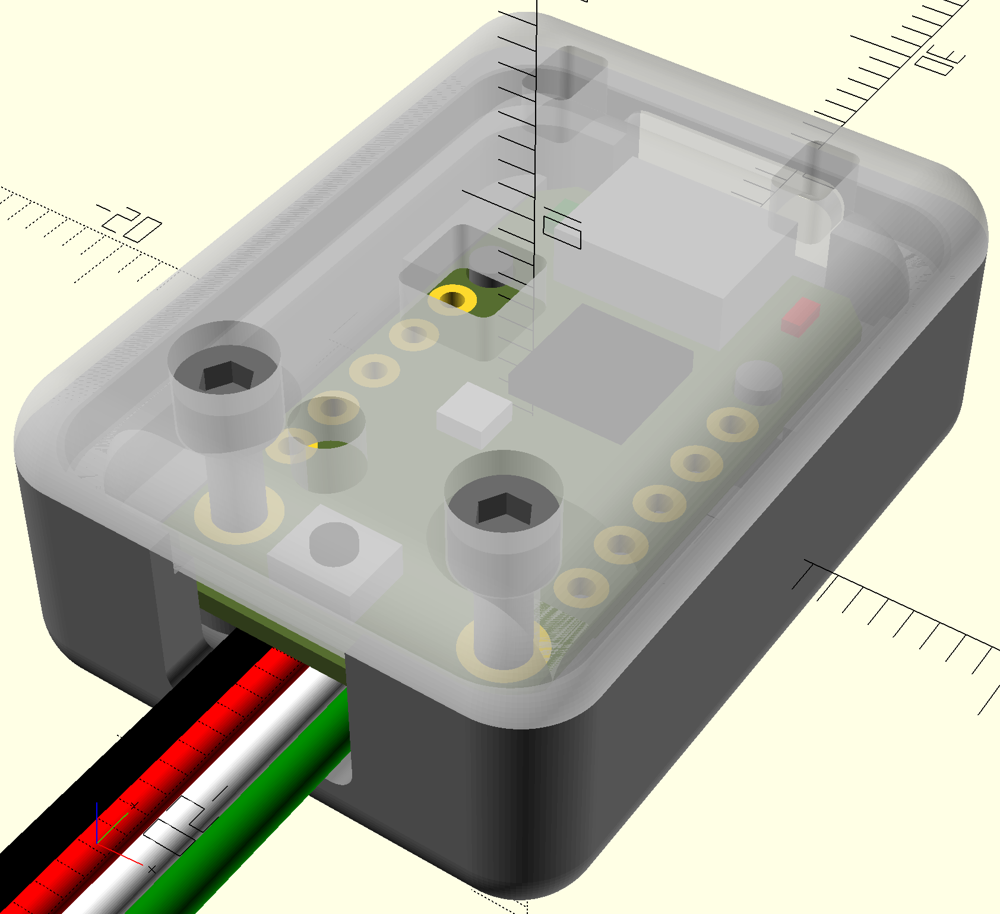

## Introduction
The Adafruit Trinket M0 is a small, low-power, inexpensive processor board with the Atmel ATSAMD21, an ARM Cortex-M0+ based microcontroller. It is versatile, packed with great features and can be programmed from the Arduino IDE but also supports CircuitPython, MakeCode, Atmel Studio and other IDE and debug environments. It's a great little board for all sorts of projects and is my current (2021) *Go-To* MCU board for lighting projects (based on Adafruit *NeoPixel* or *DotStar* LED sticks/strips), motor control, and sensor monitoring! Head over to the [Adafruit Trinket M0 Tutorial Page](https://learn.adafruit.com/adafruit-trinket-m0-circuitpython-arduino) for all of the details on the board and how to use it.

This repository provides a customizable enclosure design for the Trinket M0 in order to provide protection and mounting provisions for use in your favorite project. The enclosure requires 2x M2 mounting screws for assembly, such as these 8mm long [M2x8mm socket-head self tapping screws](https://www.amazon.com/dp/B00YBMRAH4/ref=cm_sw_su_dp). The enclosure has an access hole on one end of the enclosure for the Micro USB cable and a notch/cutout on the other end for routing GPIO, PWR, GND, or other specialty wiring to the Trinket-M0 PCB. Note that there are also access/view holes in the top enclosure part for the reset push-button switch and the LEDs.

In addition to the enclosure design, a standalone mounting base is included (useful for mounting the Trinket-M0 PCB in other projects), a simplified model of the Trinket-M0 PCB, other utilities models (e.g. generic screw & simplified wiring harness models), top-level assembly files for visualization and a test file for detecting model collisions prior to printing (and discovering a fit problem after the fact!). Continue reading below for further details ...

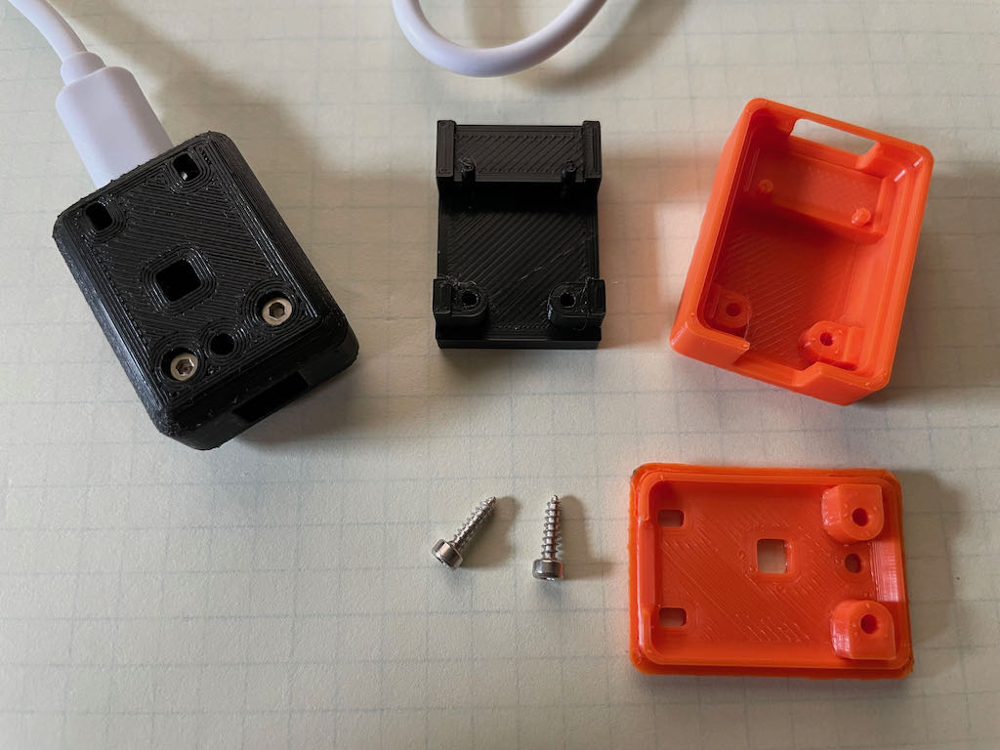

First, a few OpenSCAD design file notes:
1. All units in mm.
2. Reference level Z=0 is the bottom surface of the Trinket-M0 PWB, where it sits on the *studs* and *shelf* of the mounting base or enclosure bottom model piece.
3. Models in the repository have been tested using OpenSCAD v. 2021.01.

## Quick Start
If you would like to print the 3D enclosure model parts using the default dimensions and settings, you can use the STL files provided in this design repository. Just import the **trinket_m0_enclosure_top.stl** and **trinket_m0_enclosure_bottom.stl** files into your favorite Slicer/printing software and print them out. I recommend printing the bottom part as is and the top part flipped upside down on the build plate (with support as desired), as shown here:

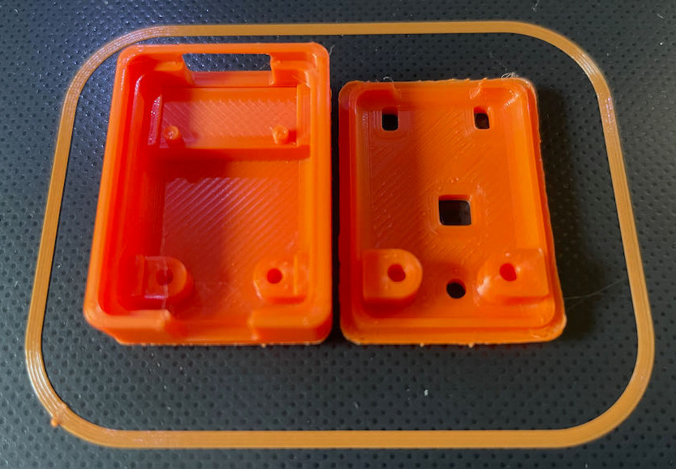

If you do not require a complete enclosure and would like to print the simple standalone mounting base design instead, use the optional **trinket_m0_mounting_base.stl** file also included in the repository.

Then continue with the Assembly Instructions section below.

## Assembly Instructions and Notes
Prior to completing the assembly, it is expected that you have already soldered any necessary wiring to GPIO, power, ground, etc., perhaps for connection to sensors, lighting or connection to an extended electronic system. A convenient way to accomplish this is to use something like the [Adafruit JST PH 4-Pin to Header Cable - 200mm](https://www.adafruit.com/product/3955) as the wiring harness for connecting the Trinket-M0 to outside circuitry (assuming 4 wires is enough for your project). I recommend cutting the pin ends of the individual wires and soldering the wires to the bottom side of the board, as it will work better with this particular enclosure design. The Trinket-M0 can be powered, programmed, and communicated with via the MicroUSB connector.

The Trinket-M0 Enclosure is designed to hold the PCB on a small *shelf* (with 2 alignment pegs) and 2 mounting studs (with screw holes) in the bottom enclosure part. The PWB will sit snugly within a slightly recessed section across these mounting surfaces with the alignment pegs protruding through the two non-plated mounting holes. The two plated mounting holes should align properly with the screw holes in the studs under the board.

Note the cutout on one end of the enclosure (with the mounting screw studs). This cutout is designed to route any necessary wires (or wire harness) soldered to the bottom of the board out of the enclosure. Ensure that the wires fit between the two mounting screw studs and through the notch in the end of the enclosure. If the wires do not fit, you may need to modify the default dimensions of the enclosure (detailed in the *Going Further: Customization* section below).

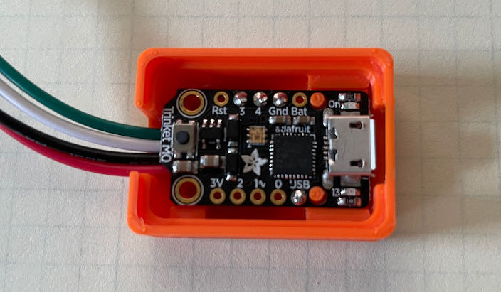

Your MicroUSB cable should also easily plug into the Trinket-M0 through the access hole. If not, you may again be required to customize some parameters in order to fit properly (or you could try a different cable with a different connection tip or back-shell design).

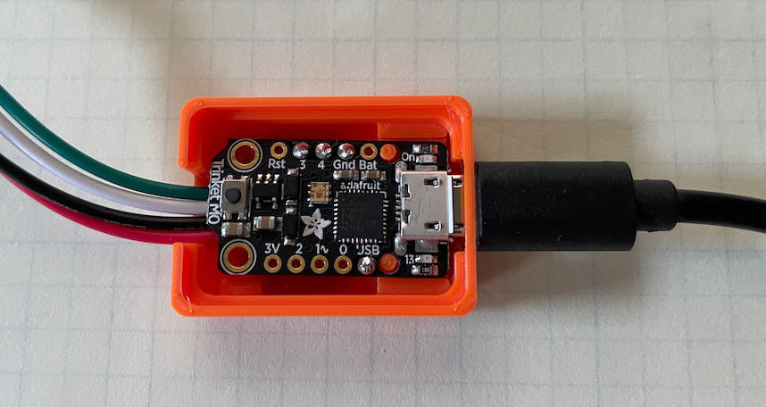

Next, orient the enclosure top part such that the inset screw holes are aligned with the screw hole studs in the bottom part and screw the top down to the bottom using the [M2x8mm screws](https://www.amazon.com/dp/B00YBMRAH4/ref=cm_sw_su_dp) mentioned in the introduction above. The screws will go through the two plated mounting holes in the PCB and hold everything together.

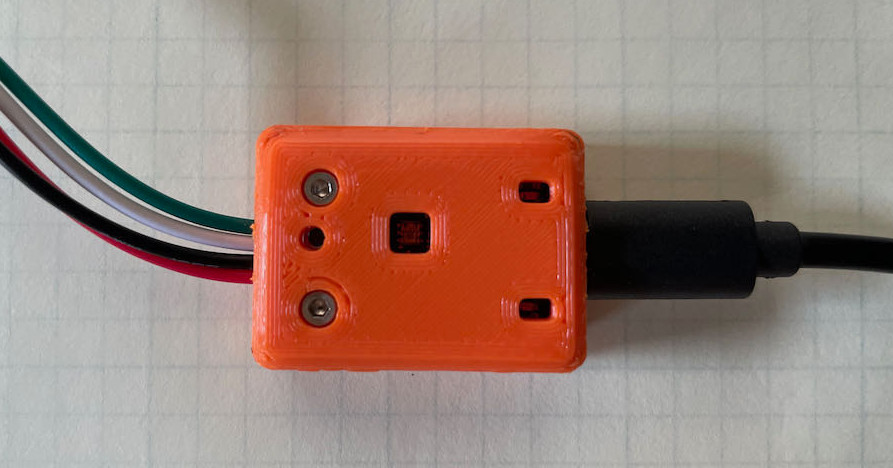

If everything seems properly aligned and the screws are completely screwed into the assembly, you should be ready to power the board by plugging in to your computer or other USB power source (using the USB connection) or through your wiring harness (if this is your intent) and you should have good visibility to all three LEDs through the top, as well as access to the Reset push-button switch (using something like a paper-clip to depress it):

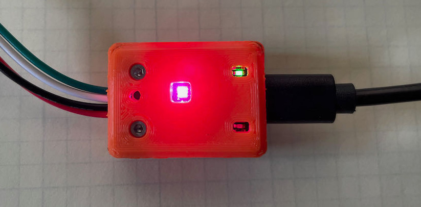

You are now ready to start programming the Trinket-M0 and have fun with that exciting project you have in the works!

## Alternate Assembly: The Standalone Mounting Base
For situations in which you don't require a fully enclosed case for the trinket (or for situations where this enclosure design prevents you from directly connecting other circuitry or wiring the way you would like), the repository also includes a simple standalone mounting base. This mounting base still provides some protection to the board (particularly the underside wiring/solder connections), and provides ease in handling when plugging/unplugging the MicroUSB cable without putting undue stress on the PCB.

The standalone mounting base is provided in the **trinket_m0_mounting_base.scad** design file. The design can be viewed, *Rendered* and *Exported as STL* for 3D printing for use in your project. The default parameters will work well with the 8mm length M2 screws mentioned above, but you can customize the dimensions to suit your own needs (higher PCB stud height, base thickness or different length screws).

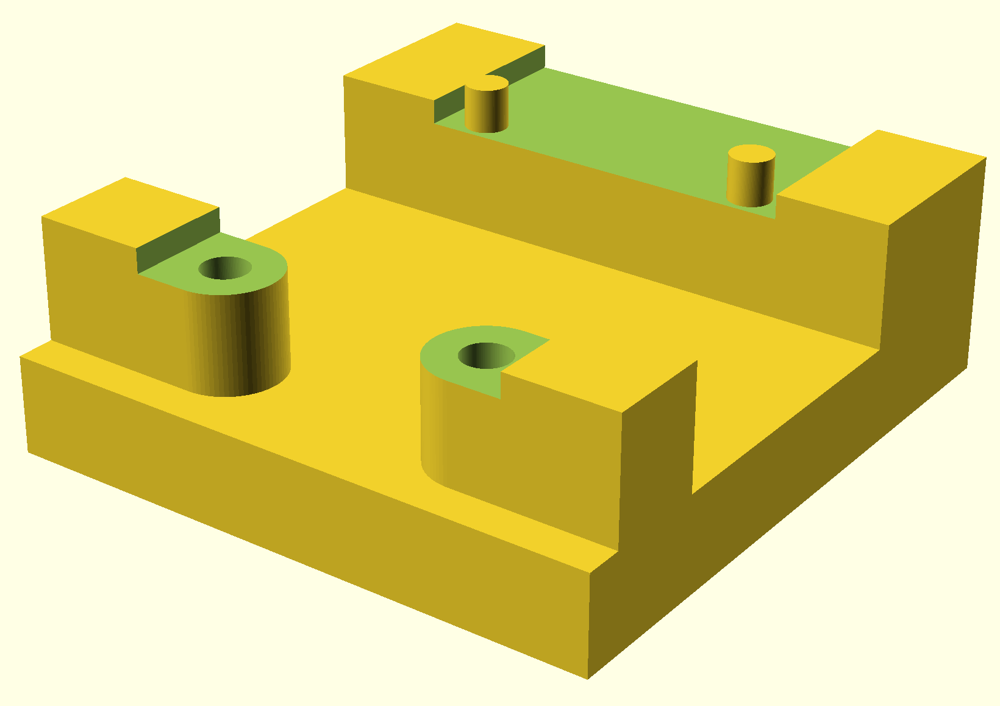 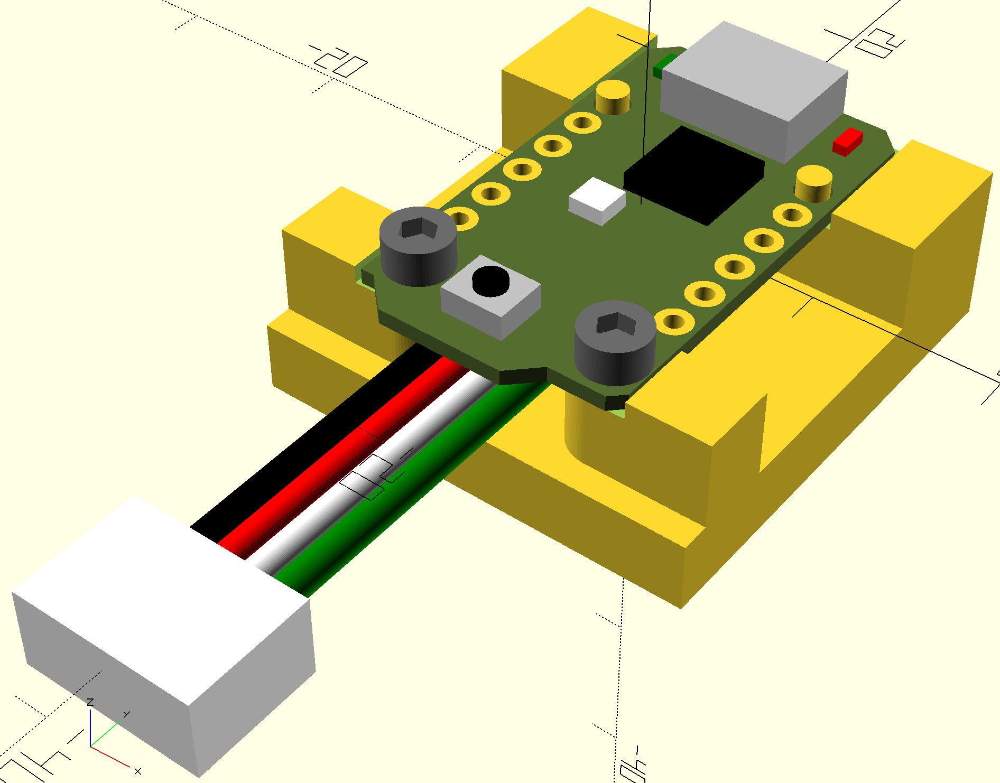

The Trinket-M0 PCB fits onto the mounting base exactly the same way it fits into the enclosure bottom model part described above (it is the same design element used by the bottom enclosure design, in fact). Once the PCB is sitting in the recessed cavity on the shelf and mounting screw studs, with the alignment pegs protruding through the PCB non-plated mounting holes, and the plated holes directly in line with the screw holes in the mounting *studs*, simply screw the PCB down using the same screws [referenced above](https://www.amazon.com/dp/B00YBMRAH4/ref=cm_sw_su_dp) and ... you're ready to go!

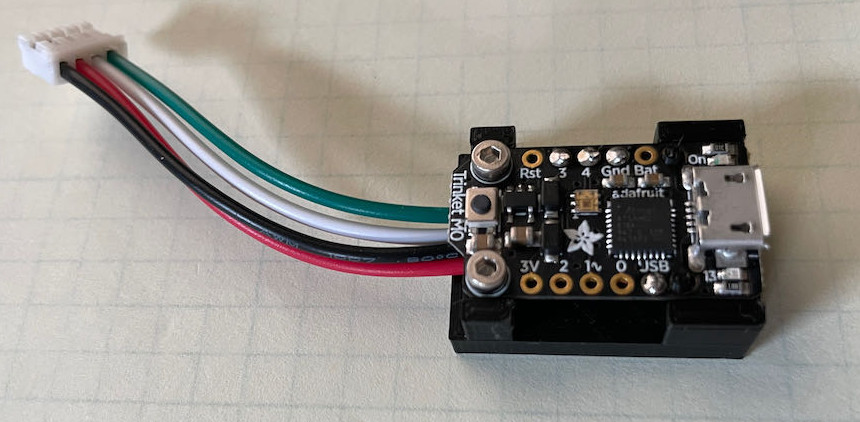

## OpenSCAD design file Use Information
In order to get a detailed look at the enclosure models, learn about the enclosure building blocks and various settings and customization options, and to create a complete enclosure from scratch - start by opening the two primary enclosure design files in OpenSCAD:
* **trinket_m0_enclosure_top.scad**: The top enclosure 3D part, and
* **trinket_m0_enclosure_bottom.scad**: The bottom enclosure 3D part

Notice that each design file should automatically provide a *Preview* of the solid model (enabled by default in OpenSCAD, or simply hit the *Preview* button if it is turned off), using the built-in default parameters. The top and bottom enclosure models should look like this:

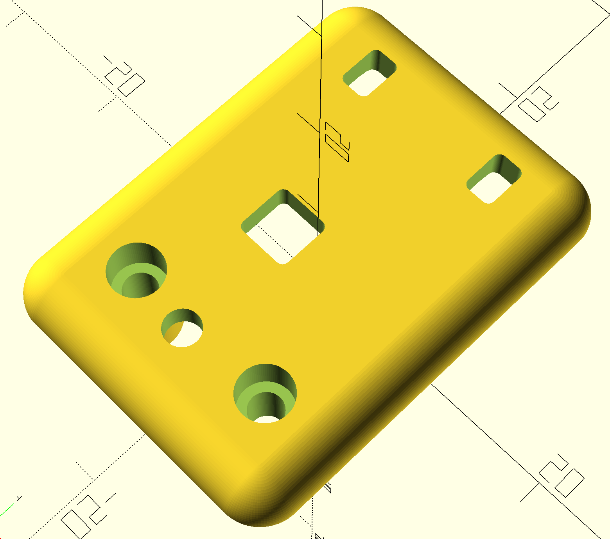 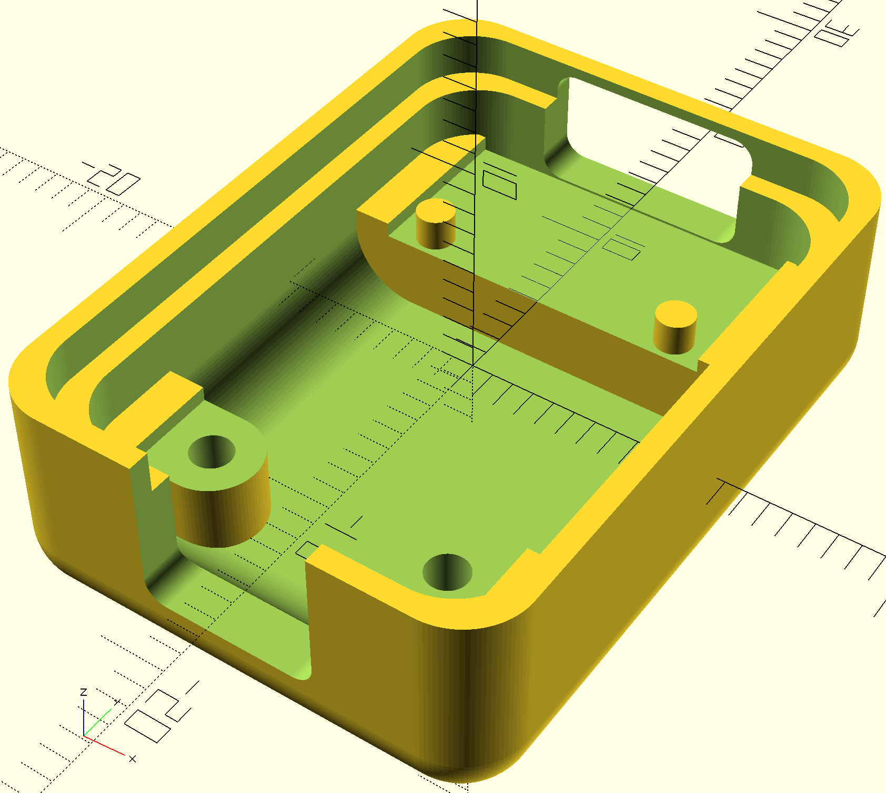

The repository contains reasonable default values for all customizable parameters, yielding a compact but durable enclosure for protection and ease in handling of the Trinket-M0 product. The default parameters will yield an enclosure that is about 31.7 x 23.2 x 13.5 mm. All of the dimension parameters and other construction options, along with the low-level module definition for all enclosure elements, are defined in a separate OpenSCAD design file: **trinket_m0_enclosure_elements.scad**. You can customize the enclosure design by changing these parameters to suit your own needs as discussed in the following section.

In order to print the enclosure model parts on your 3D printer using the default configuration, simply *Render* the design in OpenSCAD, *Export as STL* and then use these updated STL files for printing as described in the *Quick Start* section above.

## Going Further: Customization
Many of the dimensions and other parameters affect the construction of the top & bottom enclosure models can be modified to suit specific needs for your own project. Most customizable parameters are found at the top of the **trinket_m0_enclosure_elements.scad** design file. Changes to the parameters at the top of this file will be automatically reflected in both top & bottom designs, as well as high-level assembly and testing files as well. This OpenSCAD design file also contains all of the low-level modules (code for the design elements) that are used in the construction of the top & bottom enclosure parts, as well as the standalone mounting base. You can read (and modify, if you are adventurous!) the code that defines how the parts are constructed.

Looking near the top of **trinket_m0_enclosure_elements.scad**, you will see this section:

```openscad
/////////////////////////////////////////////////////////////////
//
// Enclosure dimension control variables:
//
/////////////////////////////////////////////////////////////////
rounding_radius = 3;
case_wall_thickness = 2;
pwb_stud_height = 4;
pwb_lip_height = 0.7;
pwb_cutout_enable = false; // see README, may be required for certain parameter combinations

lid_shelf_width = 1; // Width of overlap region between top & bottom parts
lid_shelf_depth = 2; // Depth of overlap between top & bottom parts

mounting_screw_length = 8;
mounting_screw_head_inset_depth = 3; // Inset depth into top enclosure part
```
... and then:
```openscad
// Recommended Default Case dimensions are all >= minimum values
// computed above. You can also set these to a fixed value as long
// as the dimension satisfies the minimum requirements (tested in
// the respective design module):
case_width         = minimum_case_width + 4;
case_length        = minimum_case_length + 1;
case_bottom_height = minimum_case_bottom_height + 4.5;
case_top_height    = minimum_case_top_height + 0;

// MicroUSB Access Hole cutout dimensions:
trinket_usb_cutout_width = 10;
trinket_usb_cutout_height = 5;
```

Change any of these settings as needed and then review the changes in the top & bottom enclosure design files, **trinket_m0_enclosure_top.scad** and **trinket_m0_enclosure_bottom.scad** respectively, or in the **trinket_m0_enclosure_assembly.scad** top-level assembly design file to observe the effect of your change(s) and then *Render*, *Export as STL* and slice/print when you are satisfied.

As an example, if you need to make the MicroUSB connector access hole cutout bigger, you could modify the default dimensions (10 mm x 5 mm) to something like the following:

```openscad
// MicroUSB Access Hole cutout dimensions:
trinket_usb_cutout_width = 14;
trinket_usb_cutout_height = 7;
```

... and you will see this change in the top-level assembly view, affecting both the top & bottom enclosure parts as necessary (the left is with default 10 x 5 mm settings, the right is the updated 14 x 7 mm opening):

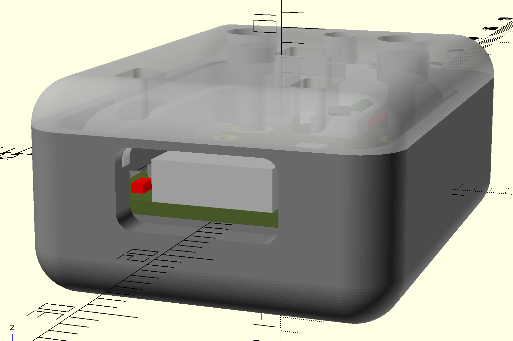 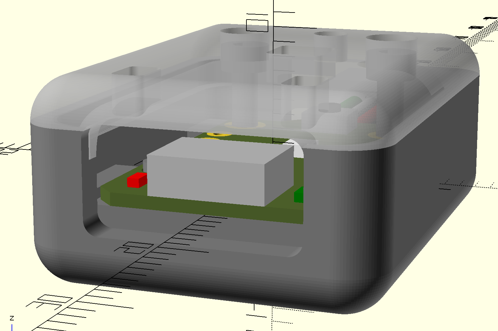

As another example, if you need additional space below the PWB for wires to come out through the wiring harness notch/cutout than the default settings provide (as discussed above in the Assembly section of this document), the easiest way to do this is to increase the height of the PCB mounting studs and shelf, by changing the `pwb_stud_height` parameter from the default value of 4 to something larger. Setting it to `pwb_stud_height = 8;` yields the following change in the bottom enclosure part (again, the left is with default settings, the right graphic shows the increased height):

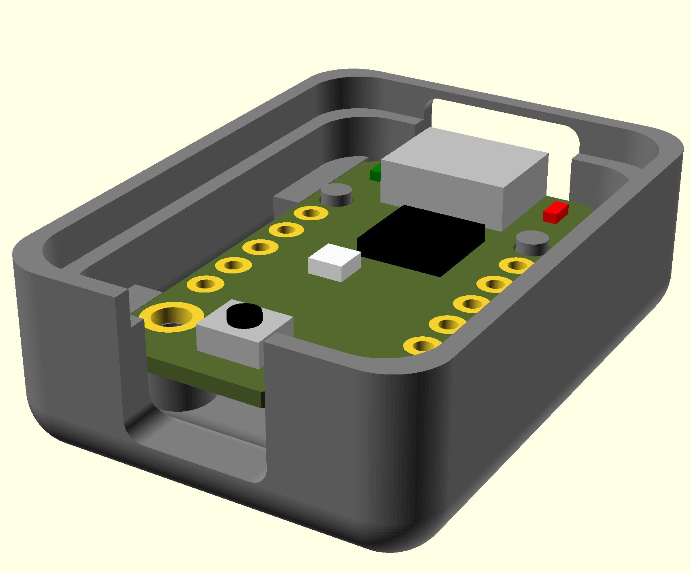 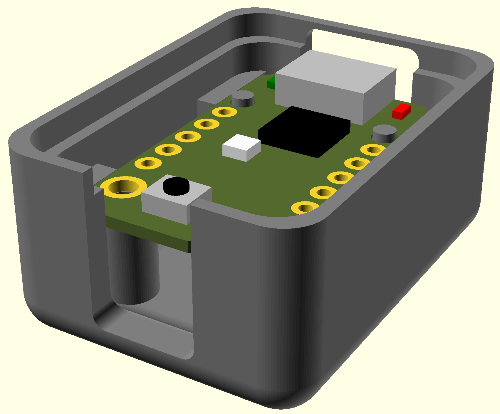

Note that changing the space between the mounting studs to obtain more room for wires or circuitry is not viable since their location is fixed by the mounting screw holes in the Trinket PCB itself, so increasing the height of the studs is the best option for this enclosure design.

Peruse the other parameters as well and modify any as needed for your own project. I have tried to make the enclosure modules as versatile as possible and use these parameters in the construction of the model. While I have done my best to ensure proper geometric modelling based on the parameters and have done some testing over a moderate range of parameter settings and combinations, it is impossible to test all combinations. Therefore, it is highly recommended that you visually check the model parts individually or using the top-level assembly design file **trinket_m0_enclosure_assembly.scad** prior to printing. Major modification probably also warrants at least some rudimentary check for *collisions* using the **trinket_m0_enclosure_collision_tests.scad** file as discussed in the following section.

## Testing Custom Parameters
As previously mentioned, it is a good idea to verify the integrity and proper fit/function of the enclosure design after modifying default dimension parameters or performing any other customization on the design prior to printing the models and attempting assembly. Certain parameter combinations may highlight some underlying conflict in how the models are built from basic elements using the parameter settings or an error in the design code itself.

Verification can be done visually on the top & bottom enclosure models individually by previewing or rendering the parts in the **trinket_m0_enclosure_top.scad** and **trinket_m0_enclosure_bottom.scad** design files as well as by checking the overall assembly using the **trinket_m0_enclosure_assembly.scad** design file. Near the top of this file, notice the boolean display control variables which allow the user to individually display the top, bottom, Trinket PCB, wiring harness and mounting hardware models. You can also control the transparency setting (alpha value) for the top & bottom enclosure parts to better see how the interior parts fit inside the enclosure:

```openscad
// Visibility settings for other objects (for testing and visualization):
display_enclosure_top = true;
display_enclosure_bottom = true;
display_trnk_m0_pwb = true;
display_wiring_harness = true;
display_mounting_hardware = true;
_screw_in_through_top_enclosure = true; // false = screw PWB directly into Mounting Studs in base

// Color alpha channel settings - 0.0-1.0 (1.0 is opaque, 0.0 is fully transparent)
top_alpha = 0.7;
bottom_alpha = 1.0; 
```

Try turning some objects off (set to `false`), such as the top, the mounting hardware and the wiring harness, and get a good look at how the PWB fits inside the bottom enclosure part. For example, setting `display_enclosure_bottom = false;` would result in the something like:

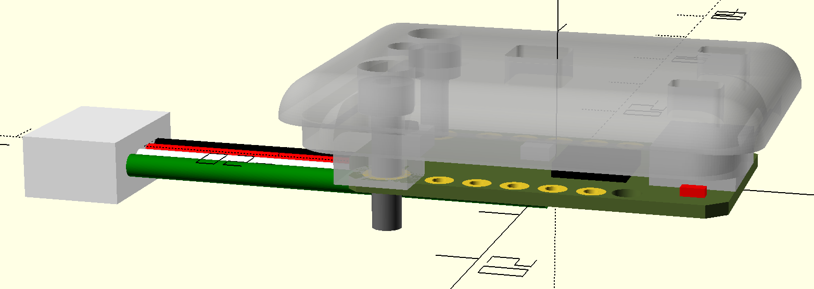

After checking various angles and turning various elements on or off in the display, everything should look like it fits well with proper alignment and some physical margin around all sides of the PCB and space for the wiring harness to route out the notch. However, some unexpected parameter settings may cause odd results, like this:

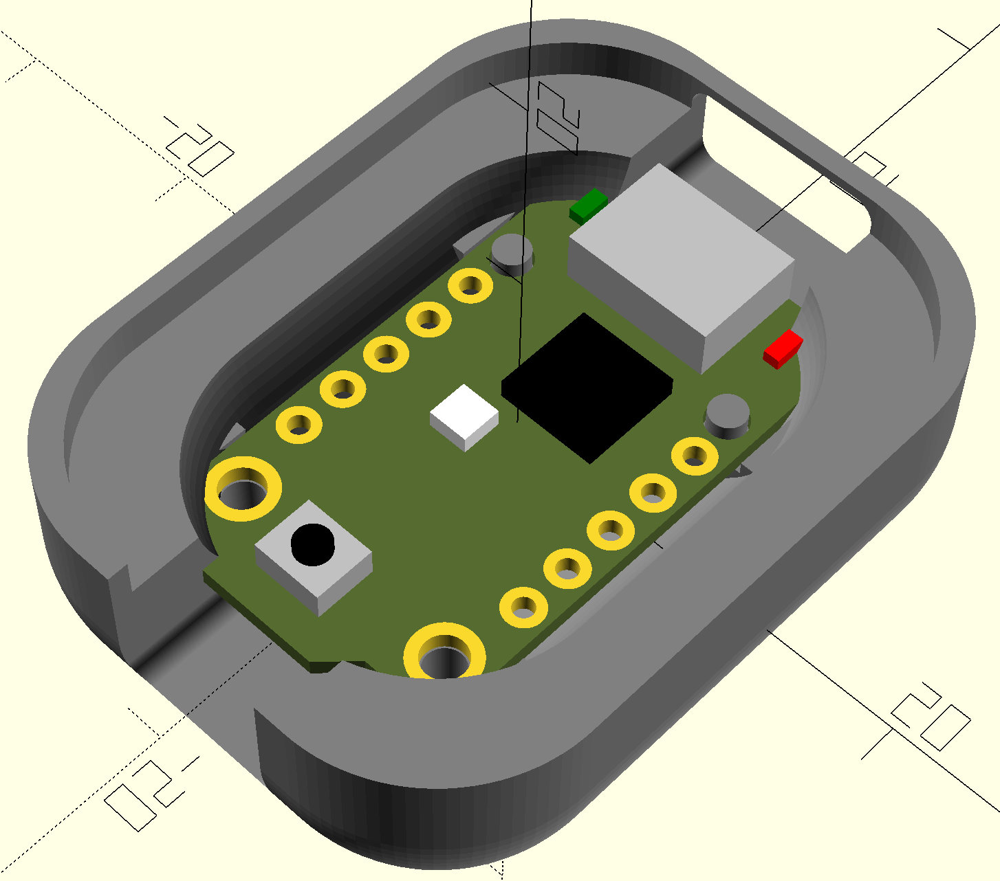

When setting the `rounding_radius = 8;` and `case_wall_thickness = 4;` notice that the construction of the model is now very rounded and eats into the inner cavity of the enclosure a bit and the bottom enclosure model is actually *colliding* with the PCB model. Oh no! This will never work ...

Your options in this scenario are to either:
  1. modify the parameters back to something that doesn't produce a physical body collision between two or more model parts,
  2. possibly increase the case dimensions (`case_width`, `case_length`, etc.) or
  3. modify the underlying design module (change the SCAD code) to fix the design to work properly for your specific needs.

In a pinch, you could try enabling an optional setting (set `pwb_cutout_enable = true;` inside the **trinket_m0_enclosure_elements.scad** design file) which attempts to fix such collisions between the PCB and the bottom part. Setting it in this case, will produce the following result:

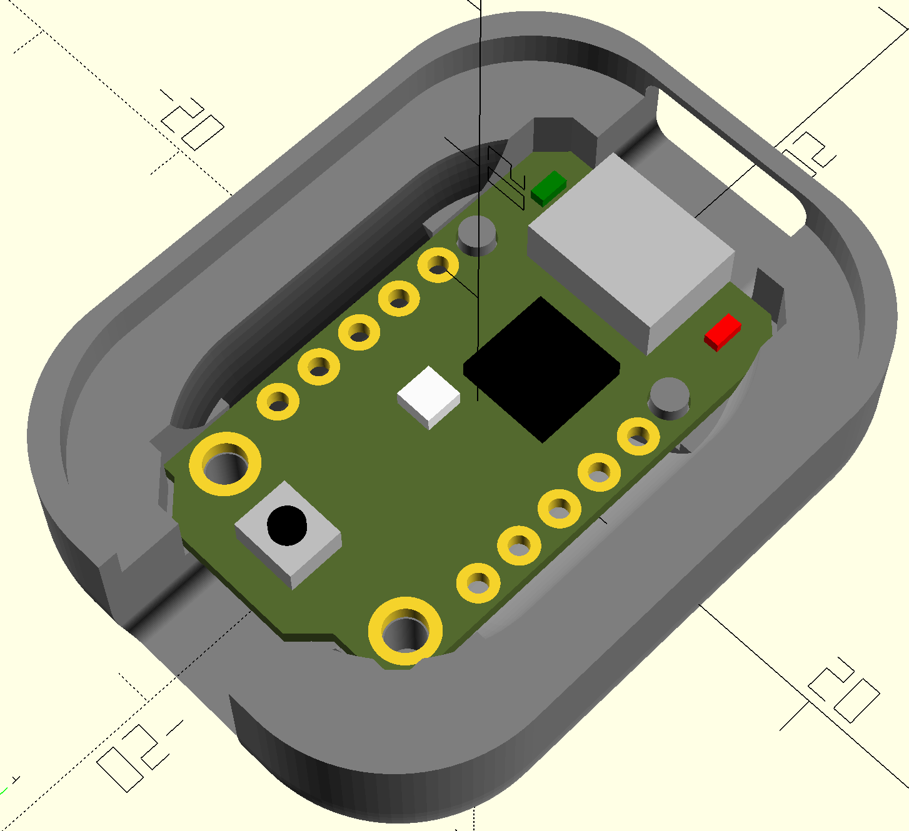

It does appear to fix the problem, but you may not know for sure until printing the parts out and trying it out. Performing these visual fit checks manually using the assembly design file can become difficult, especially when the display settings for all parts are turned on. This is particularly true when visually checking how the top & bottom parts fit together & verifying there is no problem with physical collision between various design features of these two models. The transparency feature helps, but it can still be difficult to know for sure until you print them out and see how things fit together.

However, there is an additional design file in the repository, **trinket_m0_enclosure_collision_tests.scad**, that can be used to test the design elements prior to printing by looking for *collisions* between the models directly for the customized parameters you have setup for the design. When you open this file and hit the *Preview* button (or let it Auto-preview if enabled )... this may take some time. The design will compute collisions between the PCB and the bottom enclosure part (highlighted in BLUE) and collisions between the top & bottom parts (these are highlighted in RED).

Following the above custom settings example, but with the `pwb_cutout_enable = false;` again (which should produce some collisions), you will see something like the following image on the left (PCB collisions highlighted in BLUE). The image on the right shows some collisions between the top & bottom parts (highlighted in RED), which have now been fixed in the code itself (but be on the lookout for these types of collisions when using your own parameters):

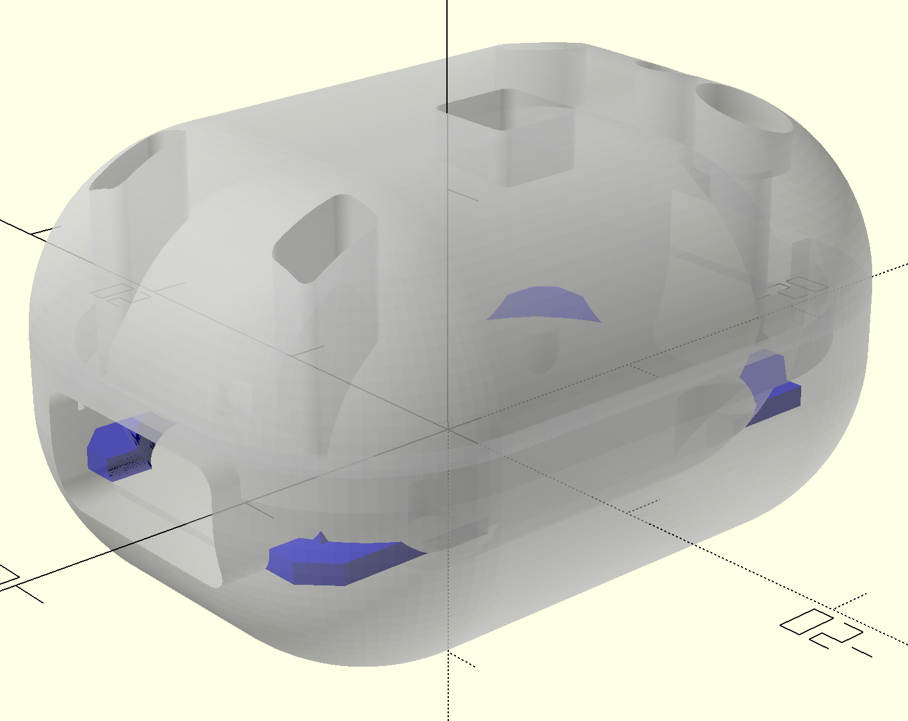 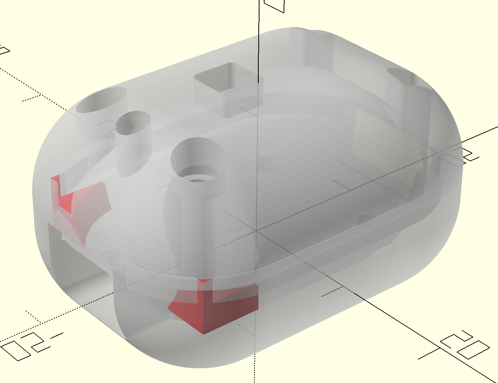

Similar to the top-level assembly design file, you can use the boolean display variables near the top of the collision test file to view various model components (PWB, Wiring Harness, etc.) if it helps in visualizing where the errors are occurring and help you address them using the advice above.

Using these methods for visual inspection and looking for collision errors will provide the confidence that your own custom parameters (or other design file edits) will work as expected when printing the models. However, the default values provided in the repository design files have been printed and tested, so if you can stick with those values you should not encounter any problems.

## Advanced Use: Adding Trinket-M0 to other projects
The Trinket-M0 enclosure or standalone mounting base can easily be added to other OpenSCAD design projects. In order to use these designs from another project, you will have to include the **trinket_m0_enclosure_elements.scad** design file in the file from where you need to reference it, as shown here:
```openscad
include <"path-to-github-repo"/trinket-m0-enclosure/trinket_m0_enclosure_elements.scad>
```
where "path-to-github-repo" is an absolute or relative path for the top-level directory above where this repository is installed.

The most straight forward approach is to use the stand alone mounting base. Here is an example of the Trinket-M0 mounted to the underside of the cover of the MuSHR open source robotic vehicle using the mounting base model:

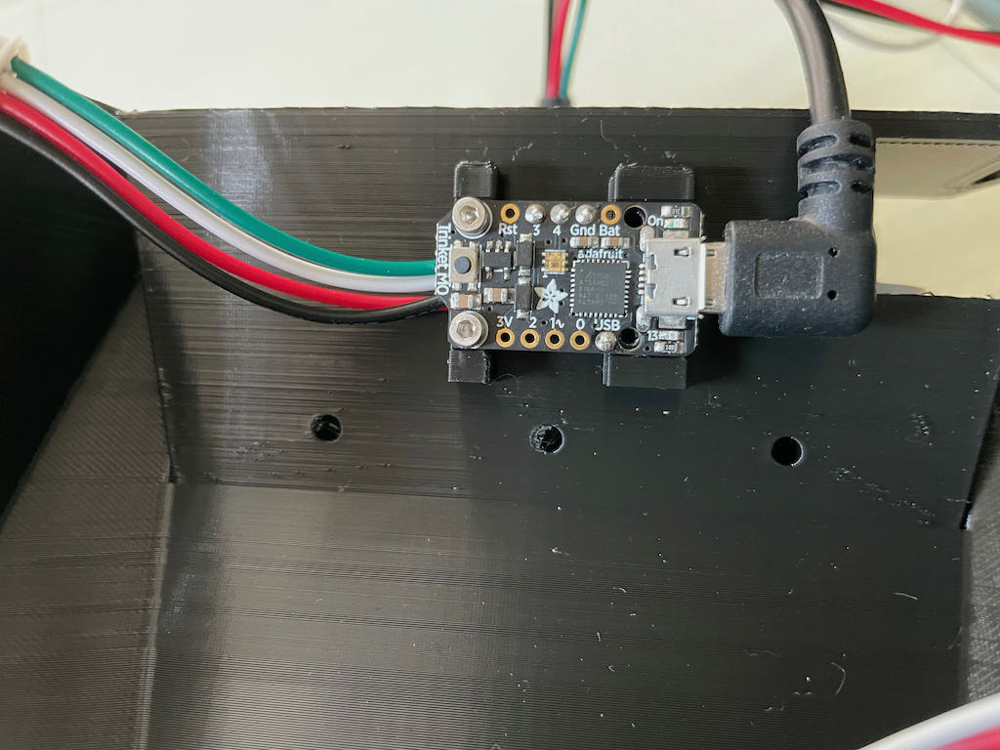

(Note: the above image shows an earlier version of the trinket mounting base design, so it does not have the alignment/mounting pegs in the *shelf*, but the idea is the same).

Once you have included the 'elements' design file in the other project, you can now add the mounting base directly to the other project by referencing the underlying *AdafruitTrinketMountingBase()* design module similar to how it is instantiated in the **trinket_m0_mounting_base.scad** design file, like so:

```openscad
AdafruitTrinketMountingBase(
    mounting_width = 25,
    base_thickness = 4,
    stud_height = 5,
    lip_height = 1);
```

Of course you may want to modify the parameters as needed to suit and *translate()* and/or *rotate()* the model for proper placement within the other design for proper model integration.

Similarly, if you would like to incorporate the full enclosure design into another project, you would use the same approach for adding the bottom model part, *AdafruitTrinketEnclosureBottom()*, into the other design (and the top model part if desired for visualization), using the same method for instantiation as illustrated in the **trinket_m0_enclosure_bottom.scad** design file, with changes to the default parameters as needed by your project:

```openscad
AdafruitTrinketEnclosureBottom(
    case_width = case_width,
    case_length = case_length,
    case_bottom_height = case_bottom_height,
    lid_shelf_width = lid_shelf_width,
    lid_shelf_depth = lid_shelf_depth,
    wall_thickness = case_wall_thickness,
    add_back_mounting_screws = false,
    enable_pwb_cutout = pwb_cutout_enable);
```

You may notice that the *AdafruitTrinketEnclosureBottom()* design module has an additional, optional setting `add_back_mounting_screws` which can be used to add M3 mounting holes to the bottom part. Setting `add_back_mounting_screws = true,` in the module instantiation would allow you to mount the Trinket-M0 enclosure model to other objects or OpenSCAD projects. The following images shows the bottom enclosure part without & with these optional mounting holes:

 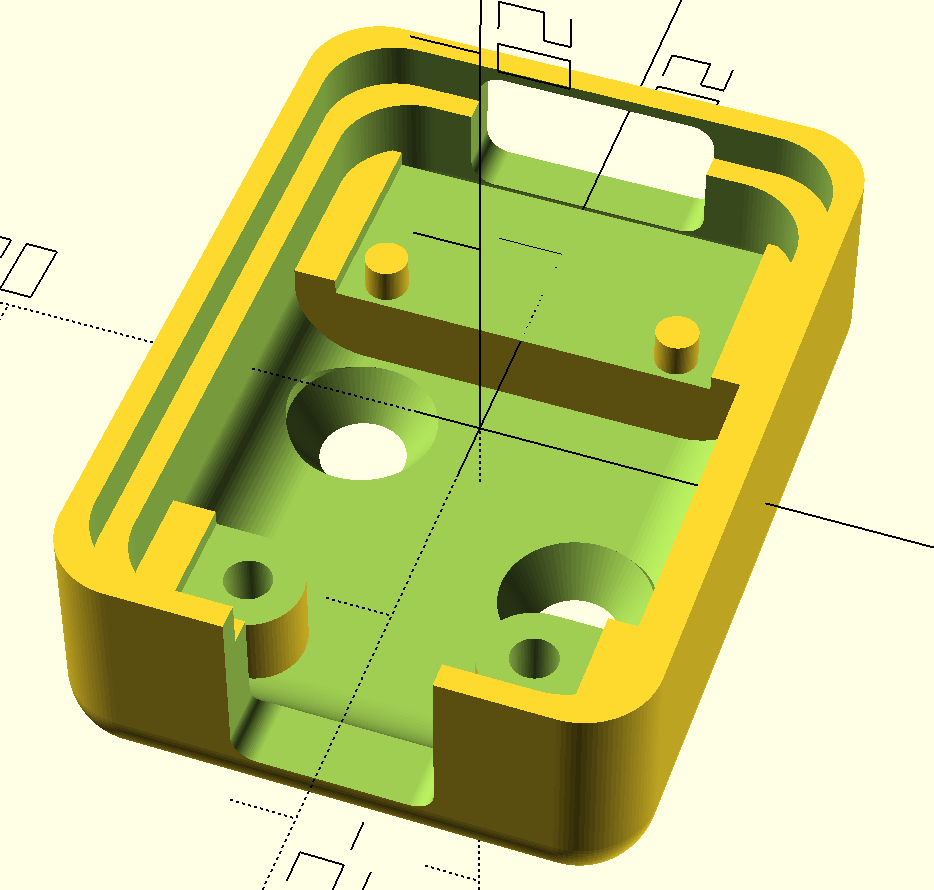

## Utility Modules
In order to help visualize and design the enclosure and mounting base model parts detailed above, I first created a few utility modules in OpenSCAD. These utility modules include 3D models of the Adafruit Trinket-M0 (**ada_trnk_m0_pwb.scad**) as well as a simple Wiring Harness and Generic Screw model (both included in the **globals_and_utilities.scad** design file). These design files are not intended to be printed, but rather for fit-check or visualization such as in the top-level assembly design or collision test files described above.

### Adafruit Trinket-M0 PCB Assembly Model
Being a staunch supporter of the Open Source hardware and software communities, Adafruit has generously provided the EagleCAD design files (schematic and board layout/routing) for their Trinket-M0 product on Github: https://github.com/adafruit/Adafruit-Trinket-M0-PCB

All dimensions of my 3D Trinket-M0 model are based on the EagleCAD board design dimensions and part placement, along with some manual measurements (such as the PCB outline and the MicroUSB dimensions). The EagleCAD design files are in inches, which I have converted to mm computationally inside the **ada_trnk_m0_constants.scad** PWB design constants file. The Trinket-M0 OpenSCAD model (**ada_trnk_m0_pwb.scad**) is shown here:

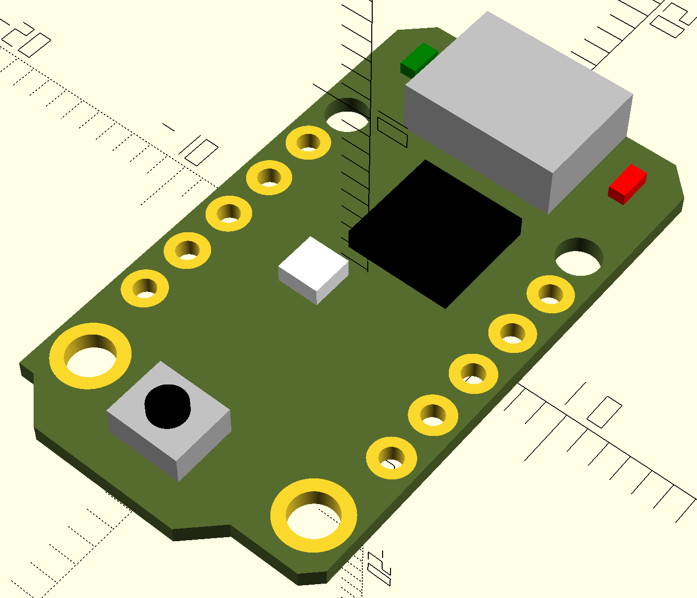

The PCB model does not include all components but does include all parts that were important for the creation of the enclosure design (such as the USB connector, LEDs, Reset Switch, mounting holes, etc.) in order to ensure proper alignment with access holes and view ports in the top and ends of the enclosure models.

### Wiring Harness Model
The wiring harness model, *jst_wiring_harness()*, provides a simple model for visualizing a 3- or 4-wire harness (with either a socket-style or header-style connector) or loose wire bundle coming from the bottom of the Trinket-M0 PCB out through the notch in one end of the enclosure design. I've based this model on the Adafruit JST PH series of 3- and 4-wire 200mm long cables, as these are convenient for many projects where only a handful of connections are required. The module has a few customization parameters; see the comments in the design file for additional usage information.

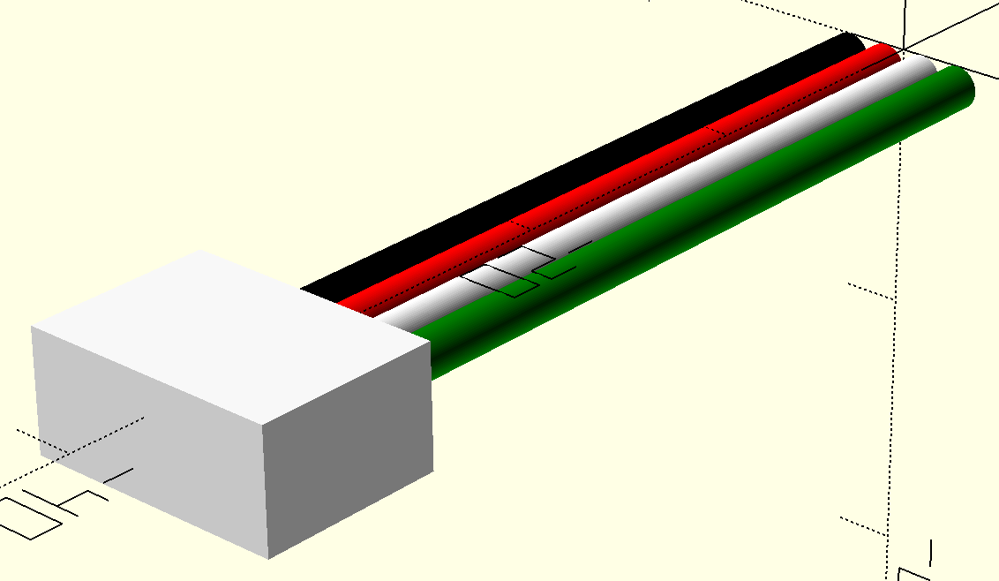

### Generic Screw Model 
The *generic_screw_model()* module is a customizable generic screw model used throughout the design files in this repository. It has configurable length, diameter, head type and size:

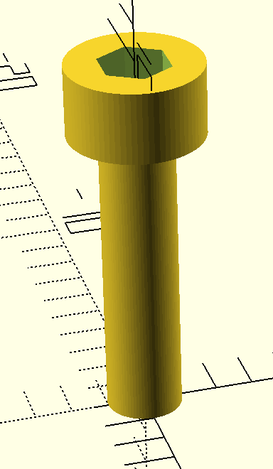 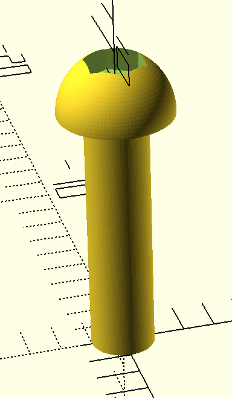 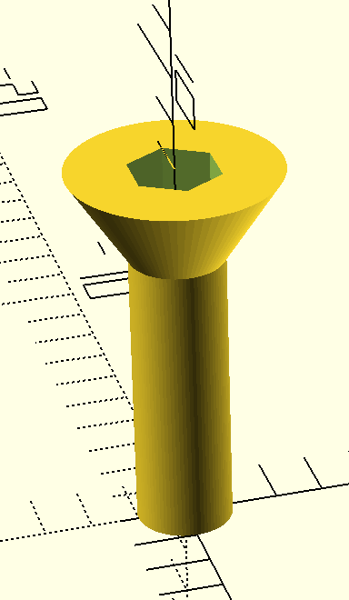

It is used predominantly for visualization (such as in the top-level assembly design files), but is also used to create mounting screw holes with parameters set accordingly (i.e. slightly oversized `screw_diam` parameter and setting the parameter `cutout_region = true,`). See the comments at the beginning of this module and sprinkled throughout the **globals_and_utilities.scad** design file for more detail on the use of this model for other purposes.

## License
Creative Commons Attribution-NonCommercial-ShareAlike 4.0. Please see accompanying license.txt file for details.
